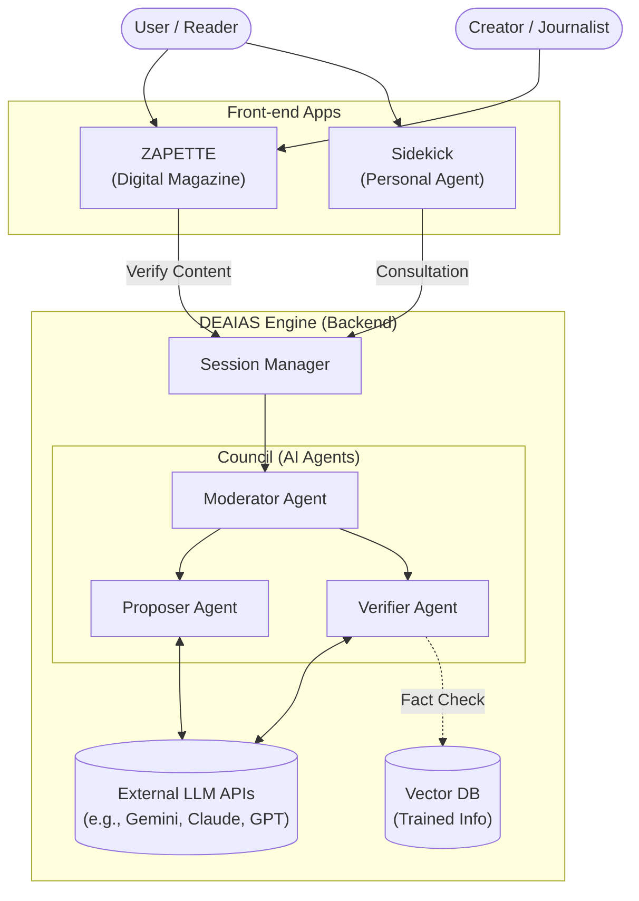
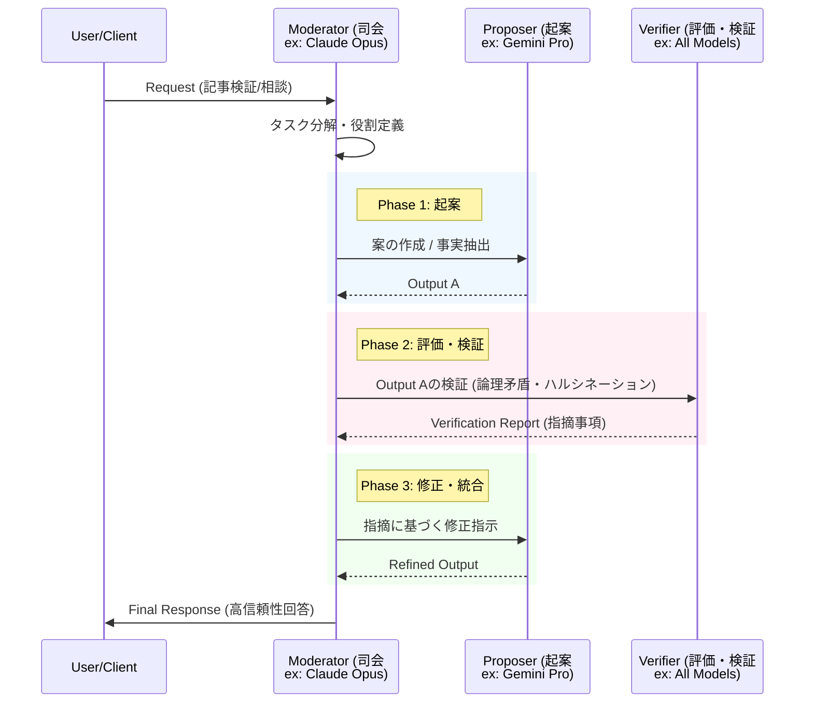
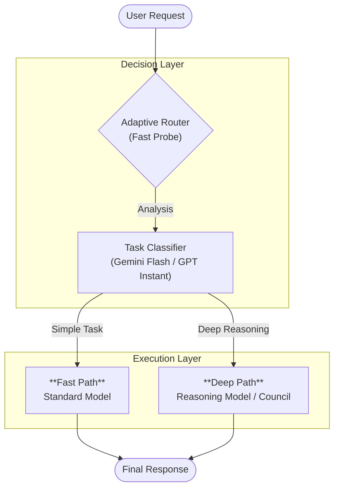

# DEAIAS: 評議・協調AIエージェント・システム アーキテクチャ

**DEAIAS** (DEliberating AI Agents System) は、複数のLLM（大規模言語モデル）を協調させ、単一モデルでは不可能な「客観性」と「論理的深さ」を実現するバックエンド・エンジンです。

本システムは、ZAPETTE（記事配信プラットフォーム）およびSidekick（パーソナルエージェント）の共通基盤として機能します。

## 1. コンセプトと目的

既存の単一モデル（Single LLM）による推論には、以下の課題があります。
- **ハルシネーション（嘘）**: 事実に基づかない情報を自信満々に出力する。
- **バイアス**: 学習データに偏った見解を出力する。
- **論理的浅さ**: 複雑な推論において、「思考の深堀り」が不足する。

DEAIASは、**「評議（Deliberation）」**という人間社会の意思決定プロセスを模倣することで、これらの課題を解決します。異なる役割を持ったエージェントが相互に監視・批判・修正を行うことで、出力の精度と信頼性を飛躍的に高めます。

## 2. システム構成概念図

## 3. マルチモデル評議フロー (Council Flow)

DEAIASの特徴は、単にモデルを切り替えるのではなく、異なる役割を持ったエージェント同士が「評議」を行う点にあります。

## 4. 役割分担による最適化

各エージェントには、その特性に合致したモデルを割り当てる（または動的に選択する）ことで、パフォーマンスを最大化します。

| ロール | 役割 | 適正モデルの特徴 | モデル例 |
| :--- | :--- | :--- | :--- |
| **Moderator** (司会) | 議論進行、論点整理、最終統合 | コンテキスト理解力、指示追従能力、論理性 | **Claude Opus** GPT Thinking |
| **Proposer** (起案者) | アイデア出し、ドラフト作成、検索 | 創造性、流暢さ、最新情報へのアクセス（Web検索） | **Gemini Pro** GPT Thinking |
| **Verifier** (評価・検証者) | 批判的検証、ファクトチェック | 厳密な論理性、高い推論能力（CoT）、知識量 | **All Models** (クロスチェック) |

## 5. 適応的認知ルーティング (Adaptive Cognitive Routing)

DEAIASは、全てのタスクに対して一律に高コストな推論モデルを使用するわけではありません。タスクの複雑性や性質に応じて、最適な「モデル（Model）」と「思考深度（Reasoning Effort）」を動的に選択する**ルーティング層**を備えています。

### 5.1 ルーティング・プロセス

1.  **初期判定 (Fast Probe)**
    *   入力されたリクエストに対し、まず各モデルファミリーの**高速・軽量モデル**（ex: Gemini Flash, GPT Instant 等）が一次分析を行います。
    *   タスクの性質を「単純検索」「論理推論」「事実確認」「創造的記述」などに分類し、必要な**思考深度**を判定します。

2.  **実行パスの決定 (Path Selection)**
    *   **Fast Path**: 単純な質問や定型的な処理と判断された場合、そのまま高速モデルが即答します。（低レイテンシ・低コスト）
    *   **Deep Path**: 複雑な文脈理解や論理検証が必要な場合、**塾思考・推論モデル**（ex: Gemini Pro Thinking, Claude Opus, GPT Thinking 等）を選択し、深い思考ステップを経て回答を生成します。

3.  **本番実行 (Execution)**
    *   選択された最適なモデルとモードで、最終的な回答生成および評議プロセスを実行します。

### 5.2 ルーティング フロー図

## 6. 建設的議事進行プロトコル (Constructive Session Protocol)

複数のAIが自由に対話すると、時として「目的のない会話（会議のための会議）」に陥り、リソースを浪費するリスクがあります。
DEAIASでは、Moderatorエージェントに対して以下の**フェーズ進行プロトコル**を強制適用し、常に結論に向かう建設的な議論を担保します。

> **Note**: 以下は実装の一例であり、タスクの種類によって動的に調整されます。

### Phase 0: 前提の宣言 (Setup)
*   議論の目的、ゴール（Accept Criteria）、制約条件をModeratorが定義し、全エージェントに共有します。
*   これ以降、この定義から逸脱する発言はModeratorによって却下されます。

### Phase 1: 聞き取り (Hearing)
*   **Proposer** がアイデアや情報を提出するフェーズです。
*   **ルール**: この段階では他者の意見に対する「評価・批判」は禁止されます（ブレインストーミング形式）。

### Phase 2: 論点の固定 (Scoping)
*   Moderatorが出揃ったアイデアを整理し、「何について議論すべきか」の論点を絞り込みます。
*   拡散した議論を収束させる重要なフェーズです。

### Phase 3: 選択肢の列挙 (Listing Options)
*   解決策の候補を構造化して並べます（例：プランA, プランB, プランC）。
*   それぞれのメリット・デメリットの予備的な洗い出しを行います。

### Phase 4: 評価・検証 (Evaluation)
*   ここで初めて **Verifier** が介入し、各選択肢に対する批判的検証（リスク分析、事実確認）を行います。
*   感情論や主観を排し、Phase 0で定義されたゴールに対する適合度をスコアリングします。

### Phase 5: 決定とアクション (Decision)
*   Moderatorが評議結果を統合し、最終的な回答を生成します。
*   必要であれば、ユーザーへの「次アクションの提案」も含めて出力します。

---
*This document is a technical specification for DEAIAS engine.*
